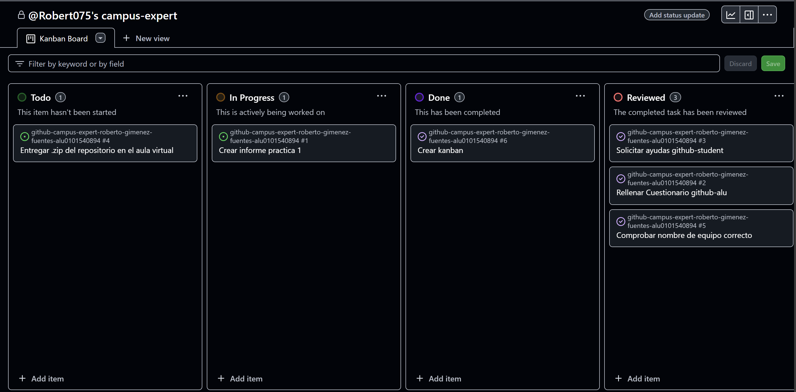

# Github Campus Expert 

- Nombre 
- Apellidos 
- aluXXXX

## Rellenar el cuestionario GitHub-Alu del campus virtual y recibir el correo confirmándolo
He rellenado el cuestionario y he recibido el correo de confirmación correspondiente.

## Crear equipo con nombre correcto
He creado el equipo con mi nombre en el github de la asignatura.

## Crear un project board kanban para este repositorio

## Solicitar el GitHub Backpack

